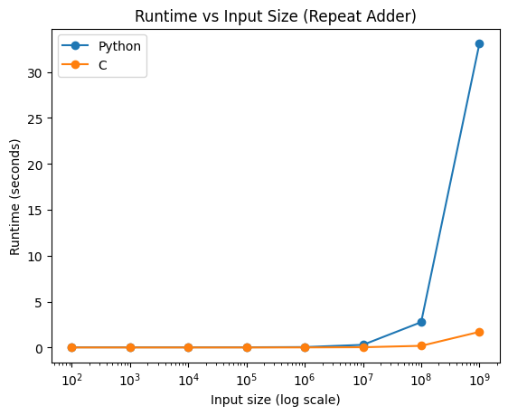
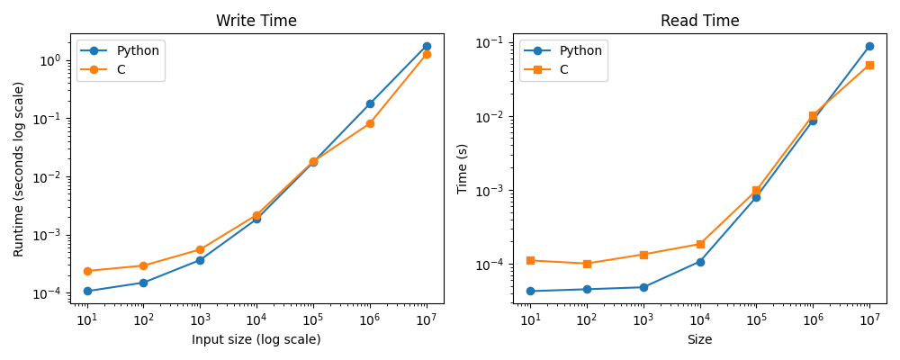

# Week 2 Tasks

## Time and benchmarking

Below is the output from testing the time command with ls:

```
totha4@cheetah:~/HPQC$ time ls
README.md

real	0m0.006s
user	0m0.000s
sys	0m0.005s
```

### C vs Python Hello World! Run Time

Below is the output from running both hello_world.py, and the compiled version of hello_world.c:

```
totha4@cheetah:~/HPQC/week_2$ time python3 week_2_sample_code/hello_world.py
Hello, World!

real	0m0.032s
user	0m0.026s
sys	0m0.004s
totha4@cheetah:~/HPQC/week_2$ time ~/bin/hello_world
Hello, World!

real	0m0.007s
user	0m0.000s
sys	0m0.004s
```

It can be seen above that the total runtime for the python version was 0.062s comapered to just 0.011s for the c version.

### C vs Python Repeat Adder

Note: The sample python code had indent errors. In the version used here, indent were corrected, but nothing else was changed.

The figure below shows the runtime of the python and c repeat adder multiplying 11 by 10, 100, 1000, etc. The runtime of both increases approximately linearly (note the fig uses a log scale); however, the python version is significantly slower, taking ~33 s compared to ~2 s at 10e9.



At 10e9 the c version returned a negative number, indicating an integer overflow.

### Internal Timing

Below is the output from both time_print programmes with an argument of 10.

```
andris@andris-ubuntu:~/DCU/high_performance_and_quantum/HPQC/week_2$ python3 time_print.py 10
0, 1, 2, 3, 4, 5, 6, 7, 8, 9, 

Time for loop: 1.239776611328125e-05 seconds

andris@andris-ubuntu:~/DCU/high_performance_and_quantum/HPQC/week_2$ ~/bin/time_print 10
0, 1, 2, 3, 4, 5, 6, 7, 8, 9, 

Runtime for core loop: 0.000061 seconds.
```
With an input of 10, the python version ran slightly faster, in about 1.2e-5 seconds, as opposed to about 6.1e-5 seconds for the c version. Increasing to input to 1e7, the python version slowed down considerably compared to the c version, taking 8.4 seconds to run as opposed to 2.1 seconds for the c version.

Modified version of the timed printing functions were made in both python and c. 

time_write takes the same single integer input as time_print; however, instead of printing to terminal, it writes each number to a new line in a file i_o_time.txt. This file is created in the directory the programme is run from. The total write time is printed to terminal upon completion. 

The counterpart, time_read, reads the file created by time_write into memory, and prints the processing time to terminal.

Note that time_write must be run first so that time_read has a file to read from. 

Both python and c versions of time_write and time_read were run with inputs from 1e1 to 1e7. The resulting runtimes are shown in the plots below.



It can be seen that from small inputs, the c version is consistently faster at both write and read functions. Above 1e4 - 1e5 however, the processing time is approximately the same for both languages.

This shows that for small data sizes, runtime is limited by the language, and the compiled c code runs more efficiently than the interpreted python. At larger data sizes however, the read/write times are dominated by the system disk speed and, rather than the language overhead. This is not seen for time_print, as these programmes print directly to terminal and do not need to write to permanent memory. 