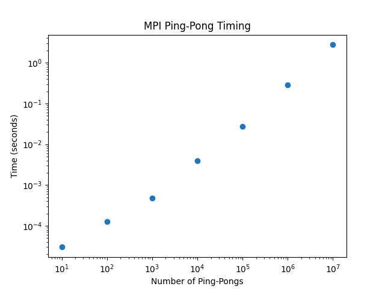
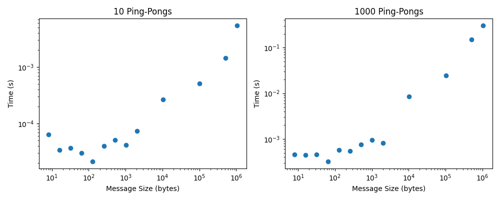

# Week 4 Tasks
## Part 1: Demonstrating Communications
### Running as-is

Below is the output from running the comm_test_mpi as-is with 6 processes.
```
mpirun -np 6 ~/bin/comm_test_mpi
Hello, I am 3 of 6. Sent 30 to Rank 0
Hello, I am 5 of 6. Sent 50 to Rank 0
Hello, I am 4 of 6. Sent 40 to Rank 0
Hello, I am 0 of 6. Received 10 from Rank 1
Hello, I am 0 of 6. Received 20 from Rank 2
Hello, I am 0 of 6. Received 30 from Rank 3
Hello, I am 0 of 6. Received 40 from Rank 4
Hello, I am 0 of 6. Received 50 from Rank 5
Hello, I am 1 of 6. Sent 10 to Rank 0
Hello, I am 2 of 6. Sent 20 to Rank 0

```

It can be seen that the order in which the different processes print is somewhat random; however, the rot (rank 0) receives messages from the other ranks in order.

### Functionalising

Functionalising and further development was done on a copy of the original code comm_test_own.c

The following functions were created and moved outside of main()

- root_task(): the code the root rank executes
- client_task(): the code the client pranks execute
- initialise_mpi(): a wrapper for the mpi initialisation steps
- check_ranks(): a wrapper for checking if the correct number of ranks are given, and error handling.

These changes are documented in the commit history.

### Experimenting With Send Types

The different version of send were implemented in comm_test_own. The different versions can be seen in the commit history.

#### Ssend()

The syntax of Ssend() (synchronous send) is identical to regular send(), so implementation was simple. In the case of this code, Ssend should not impact the result, as root is ready to receive from the start, and no process needs to be waited for. 

The output with 6 processes printed in the same random order as with Send().
```
mpirun -np 6 ~/bin/comm_test_own
Hello, I am 1 of 6. Sent 10 to Rank 0
Hello, I am 4 of 6. Sent 40 to Rank 0
Hello, I am 5 of 6. Sent 50 to Rank 0
Hello, I am 0 of 6. Received 10 from Rank 1
Hello, I am 0 of 6. Received 20 from Rank 2
Hello, I am 0 of 6. Received 30 from Rank 3
Hello, I am 0 of 6. Received 40 from Rank 4
Hello, I am 0 of 6. Received 50 from Rank 5
Hello, I am 2 of 6. Sent 20 to Rank 0
Hello, I am 3 of 6. Sent 30 to Rank 0

```

#### Bsend()

Buffered send required slight modifications to the code, as memory has to be allocated to the buffer and handed to mpi. This was done by adding the following lines to client_task() before MPI_Bsend():
```
// set up buffer and allocate memory
int buffer_size = sizeof(int) + MPI_BSEND_OVERHEAD;
void *buffer = malloc(buffer_size);

// hand buffer to mpi
MPI_Buffer_attach(buffer, buffer_size);
```
Like with Ssend(), the output from this was expected to be the same as regular Send() as root has no other processes to run before receiving.

Like before, the output with 6 processors printed in a seemingly random order.
```
mpirun -np 6 ~/bin/comm_test_own
Hello, I am 0 of 6. Received 10 from Rank 1
Hello, I am 0 of 6. Received 20 from Rank 2
Hello, I am 1 of 6. Sent 10 to Rank 0
Hello, I am 2 of 6. Sent 20 to Rank 0
Hello, I am 4 of 6. Sent 40 to Rank 0
Hello, I am 5 of 6. Sent 50 to Rank 0
Hello, I am 0 of 6. Received 30 from Rank 3
Hello, I am 0 of 6. Received 40 from Rank 4
Hello, I am 0 of 6. Received 50 from Rank 5
Hello, I am 3 of 6. Sent 30 to Rank 0
```

#### Rsend()

Like Ssend() the syntax for Rsend() is identical as regular send(). Implementation was therefore trivial.

Like with all the previous sends, Rsend() is expected to behave the same, however, as it relies on root being ready, it may throw an error if a small timing mismatch occurs from all the processes trying to send at once. In practice, with this code, this was not observed over the 10 or so test runs, and the output was the same as for all the previous versions.
```
mpirun -np 6 ~/bin/comm_test_own
Hello, I am 4 of 6. Sent 40 to Rank 0
Hello, I am 3 of 6. Sent 30 to Rank 0
Hello, I am 2 of 6. Sent 20 to Rank 0
Hello, I am 5 of 6. Sent 50 to Rank 0
Hello, I am 0 of 6. Received 10 from Rank 1
Hello, I am 0 of 6. Received 20 from Rank 2
Hello, I am 0 of 6. Received 30 from Rank 3
Hello, I am 0 of 6. Received 40 from Rank 4
Hello, I am 0 of 6. Received 50 from Rank 5
Hello, I am 1 of 6. Sent 10 to Rank 0

```

#### Isend()

For the Isend() implementation, an extra lines needed to be added to client_task() after MPI_Isend():
```
MPI_Wait(&request, MPI_STATUS_IGNORE);
```
This line blocks any further election until the root returns confirmation that it received the message.

As the client process in this code does nothing after sending its message, this should not change the functioning of the code. The output from running it with 6 processes is shown below.
```
mpirun -np 6 ~/bin/comm_test_own
Hello, I am 2 of 6. Sent 20 to Rank 0
Hello, I am 3 of 6. Sent 30 to Rank 0
Hello, I am 4 of 6. Sent 40 to Rank 0
Hello, I am 5 of 6. Sent 50 to Rank 0
Hello, I am 0 of 6. Received 10 from Rank 1
Hello, I am 0 of 6. Received 20 from Rank 2
Hello, I am 0 of 6. Received 30 from Rank 3
Hello, I am 0 of 6. Received 40 from Rank 4
Hello, I am 0 of 6. Received 50 from Rank 5
Hello, I am 1 of 6. Sent 10 to Rank 0

```
#### Comparison

All four versions of send were found to function the same in this application. As such, for a simple programme like this, regular Send() is likely the simplest and most reliable choice.

### Implementing Timing

Timing was implemented by using timing functions defined in code from week 2. Both send and receive functions were timed. The results are shown below with 6 processors.
```
mpirun -np 6 ~/bin/comm_test_own
Rank 5 took 0.000009 seconds to send
Rank 1 took 0.000011 seconds to send
Rank 2 took 0.000013 seconds to send
Rank 3 took 0.000009 seconds to send
Rank 4 took 0.000013 seconds to send
Rank 0 took 0.000080 seconds to read from 1
Rank 0 took 0.000003 seconds to read from 2
Rank 0 took 0.000002 seconds to read from 3
Rank 0 took 0.000002 seconds to read from 4
Rank 0 took 0.000002 seconds to read from 5
```
The runtime for the message sending is tiny, on the order of 1e-5, 1e-6 seconds with some seemingly random variation. However, receive generally appears to be faster.

## Part 2: Benchmarking Latency and Bandwidth

### Ping-pong Message Latency

The ping-pong logic was implemented in ping_pong.c. The programme requires exactly 2 ranks (a ping and a pong) and exactly 1 integer argument that sets how many ping-pong cycles to run, e.g.:
```
mpirun -np 2 ~/bin/ping_pong 100
```
The plot below shows the runtime against the number of ping-pong cycles. It can be seen that time increases approximately linearly with the number of massage cycles.



### Ping-pong Bandwidth

A second version of the ping-pong programme, ping_pong_bandwidth.c, was made that passes a set number of bytes with each message. The programme take an extra positional argument, which sets the size of the data in bytes, e.g.:
```
mpirun -np 2 ~/bin/ping_pong 100 1024
```
The data is generated by creating an array of integers (zeros) with the length of data_size/sizeof(int). This guarantees the correct data size on any system. 

Note that the generated data will be rounded down to the nearest integer multiple of the size of an int on the given system.

The plots below show the time for a 10 and 1000 ping-pongs with data sizes from 8 bytes to 1 MiB.



It can be seen that in both figures, the runtime is approximately constant up to 1024 bytes, then rises linearly. This suggests that for small data sizes, the runtime is limited by the message passing overhead, rather than the true bandwidth.

A linear fit was done on the above 1024 bytes section of the 1000 ping pong figure. The fit yielded a y-intecept of 0.44 +/- 0.03 milliseconds and a slope of (2.90 +/- 0.04)e-9 seconds per byte. This suggests a latency of about 0.4-0.5 milliseconds and a bandwidth of about 3.45 MB/s.

## Part 3: Collective Communications

A copy of magnitude_mpi_v2.c from week 3 was made here and named collective_comm_test.c. Modification to the code can be traced though the commit history.

### Broadcast, Scatter, DIY

The original version of the code used a DIY approach, where each rank calculated its own chunk of the vector.

As the vector generation is relatively trivial, and the processes can do it in parallel, broadcast or scatter may slow down the execution, as they add additional messaging overhead.

With no modifications, the code took 0.705 seconds or real time to execute with an input of 10000.

To implement broadcasting, the following sections were added to the root and client tasks:
```
void root_task(int num_arg, int uni_size)
{
    ...

    // creates full vector
    int *vector = malloc(num_arg * sizeof(int));
	// assignes values to vetor
    initialise_vector(vector, 0, num_rag);
    // broadcasts to all processes
    MPI_Bcast(vector, num_arg, MPI_INT, 0, MPI_COMM_WORLD);

    ...
}

void client_task(int my_rank, int num_arg, int uni_size)
{
    ...

    // allocate memory for full vector
    int *vector = malloc(num_arg * sizeof(int));
    // receive broadcast from root
    MPI_Bcast(vector, num_arg, MPI_INT, 0, MPI_COMM_WORLD);

    ...
}

```
With these changes, the code took 0.730 seconds of real time to execute with an input of 10000.

For scatter, the following changes were made to the root process:
```
void root_task(int num_arg, int uni_size)
{
    ...
    
    // allocate memory for local vector chunk
    int *local_vector = malloc(chunk * sizeof(int));

    // scatter to all processes
    MPI_Scatter(vector, chunk, MPI_INT, local_vector, chunk, MPI_INT, 0, MPI_COMM_WORLD);


	// calculates local sum
    int local_sum = vector_magnitude_squared(local_vector, chunk);
    
    // root now needs to hadle remainder as well os needs to sum the end of the vector
    int remainder_sum = vector_magnitude_squared(vector + (num_arg- remainder), remainder);

    ...
}

```
Note that the remainder handling had to be moved from the last process to root, as scatter only works with equal chunk size.

With scatter, the runtime was 0.715 seconds of real time with an input of 10000

### Gather, Reduce

To implement gather and reduce, a copy of collective_comm_set.c was made, gather_reduce_test.c.

For implementing gather, the following changes were made to the root and client tasks:
```
oid root_task(int num_arg, int uni_size)
{
    ...

    // allocate memory to all results
    int *all_results = malloc(uni_size * sizeof(int));
    // gather from all ranks
    MPI_Gather(&local_sum, count, MPI_INT, all_results, 1, MPI_INT, 0, MPI_COMM_WORLD);

    // sum resulst
    int total_sum = 0;
    for (int rank = 0; rank < uni_size; rank++)
    total_sum += all_sums[rank];

    ...
}

void client_task(int my_rank, int num_arg, int uni_size)
{
    ...

    // send result to root
    MPI_Gather(&local_sum, count, MPI_INT, NULL, 1, MPI_INT, 0, MPI_COMM_WORLD);

    ...
}
```
With the implementation of gather, the runtime was 0.755 seconds of real time with an input of 10000. This is slightly slower than the send/receive version.

To implement reduce, the summing loop in root task was simple replaced by:
```
// crate sun variable
    int total_sum = 0;
    // get results from all ranks
    MPI_Reduce(&local_sum, &total_sum, count, MPI_INT, MPI_SUM, 0, MPI_COMM_WORLD);
```
Similarly, MPI_Gather() was replaced by MPI_Reduce in the client task. With reduce, the programme executed in 0.742 seconds of real time with an input of 10000.

### Custom Reduce Operation

For this task, a copy of gather_reduce_test.c was made, custom_reduce.c.