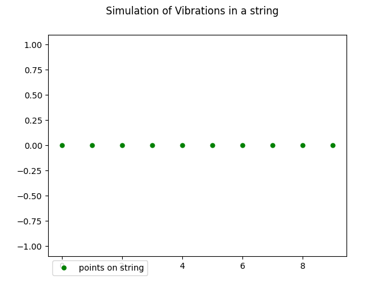
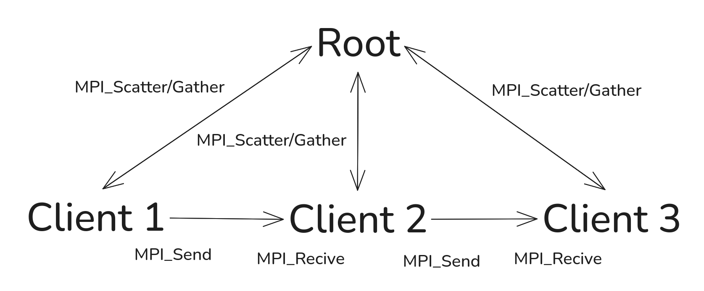
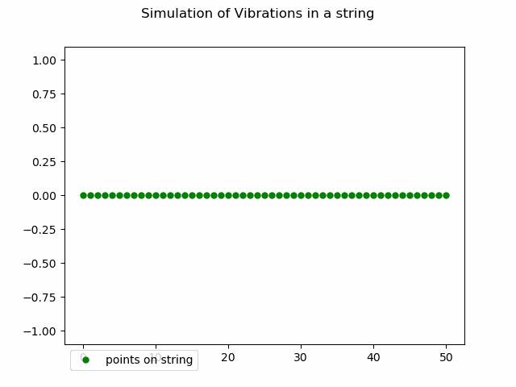
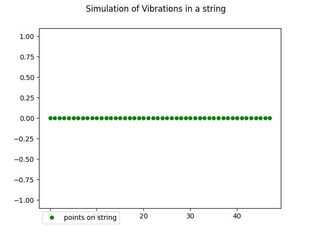

# Week 5 Tasks

## Part 1: Using and Updating the Code

string_wave.c was run with an input of 10, and a GIF was made from the resulting data as shown below.



A copy of sting_wave.c was made, string_wave_custom.c, to implement any modifications.

The hard coded variable were removed, and check_args() was updated to check for four arguments, points, cycles, sample, path. The calculation of time_step and step size was also moved to this function to clean up main().
```
void check_args(int argc, char **argv, int *points, int *cycles, int *samples, char **path, int *time_steps, double *step_size)
{

	// check the number of arguments
	if (argc == 5) // program name and numerical argument
	{
		// declare and initialise the numerical argument
		*points = atoi(argv[1]);
		*cycles = atoi(argv[2]);
		*samples = atoi(argv[3]);
		*path = argv[4];

		// creates variables for the vibration
		*time_steps = *cycles * *samples + 1;
		*step_size = 1.0 / *samples;
	}
    ...
}
```
The format for running the updated code is:
```
~/bin/string_wave_custom [points] [cycles] [steps] [path]

e.g.

~/bin/string_wave_custom 50 10 5 ~/data/temp/test_outpu.csv
```

A copy of the python file animate_line_file.py was also made, animate_line_custom.py to make the modification.

## Part 2: Parallelising

### Implementation strategy

A copy of sting_wave_custom.c, sting_wave_mpi.c, was made for the implementation of MPI.

The core of the parallelization was done by splitting the string into equal sized segments, and distributing the segments using MPI_Scatter. At the end, the data was collected with MPI_Gather. However, as the position of each point is calculated based on the previous one, boundary positions had to be passed between neighbouring ranks. This was done with MPI_Send/MPI_Recv.

The basic messaging logic is illustrated below.



Pseudocode of the functioning of the root and client tasks is given below.

```
root_task:

	Generate and initialize all points on the string

	MPI_Scatter() chunks of points to every rank (includin self)

	initialise array for locally calculated positions

	For every time step:
		calculate next position of each point
		add positions the locall data array
		MPI_Send() position of last point to next rank

	initialise array for all data from all ranks

	MPI_Gather() the data from all the ranks 

	Print data to file

client_task:

	MPI_Scatter() recive chunk form root

	initialise array for locally calculated positions

	For every time step:
		MPI_Recv() position of last point in previous rank
		calculate next position of each point
		add positions the locall data array

		If not last rank:
			MPI_Send() position of last point to next rank
	
	MPI_Gather() send local data to root

```
Writing to a file from multiple processes risks data corruption, and previous benchmarking suggests that the writing to disk is generally slow. Therefore, the data was aggregated in memory, and written out once at the end of the process. This approach does, however, limit the size of the simulation to the available memory.

A notable change that had to be made in the code was to create separate update_position functions for root and clients. For root, the same logic as in the original code was used, with the driving sine wave providing the initial position. For the client processes however, this had to be modified to set the initial position based on what is received from the previous rank, not the driving sine wave.

### MPI Output

Below are the GIFs generated with the same inputs of 50 points, 5 cycles, 25 samples from the original code (top) and the mpi version (bottom)




Two issues in the mpi version (bottom) are immediately apparent. First the number of points are slightly less. The mpi version was run with 4 ranks, and in the current version there is no handling of the remainder. As such, it only simulates (50//4)*4 = 48.

The second issue is a small misalignment in the points that is introduced about half a cycle in and propagate through the wave. This is likely an indexing issue as the ranks pass position values to their neighbours.

### MPI Performance

Compared to the original serial code, the parallel implementation was significantly slower. 
```
time  ~/bin/string_wave_custom 50 5 25 ~/data/test.csv

real	0m0.006s
user	0m0.003s
sys	0m0.003s

time mpirun -np 4 ~/bin/string_wave_mpi 50 5 25 ~/data/test.csv

real	0m0.639s
user	0m0.130s
sys	0m0.490s

```
It can be seen above, the with 4 processors, the mpi version took more than a 100 times longer to run with the same parameter. Increasing the number of processes from 4 to 8 or 16 does not improve performance, and actually slows it down slightly more. The wave problem in its current form in, fundamentally, serial. The motion of the points is calculated from left to right, with each element being calculated based on the previous one. So, while the string can be broken up into segments and distributed to ranks, each rank needs to wait for the previous to finish and pas its last position. As such, this implementation is not truly parallel, and splitting it among several ranks only add messaging overhead.

Increasing the size of the simulation, the messaging overhead no longer dominates the runtime, and the serial and parallel implementations run in about the same time.
```
time ~/bin/string_wave_custom 1000 500 250 ~/data/test.csv

real	0m21.469s
user	0m19.455s
sys	0m1.828s


time mpirun -np 4 ~/bin/string_wave_mpi 1000 500 250 ~/data/test.csv

real	0m24.331s
user	0m25.793s
sys	0m6.439s
```

### Modifications and Improvements

#### Misalignment Bug

The small misalignment seen in the GIF generated from the first implementation was cased by the incorrect order of position updates and sending to the next rank. The ranks were updating their positions first, then sending the last position to the next rank. This caused an indexing mismatch, where the ranks were expecting the 0-th position, but were receiving the 1-st. Changing the order to send first, then update after fixed the issue, as seen in the GIF below.


#### Further Improvements

Handling the remainder is more complex in this programme than it was in the vector addition one. In the vector addition, the order did not matter. Therefore, the remainder from the end could be added to the first chunk, handled by root, with no issues. In the string simulation however, order is critical.

One potential solution could be removing the remainder form the front of the vector, and adding it to the root chuck from the beginning.

```


```